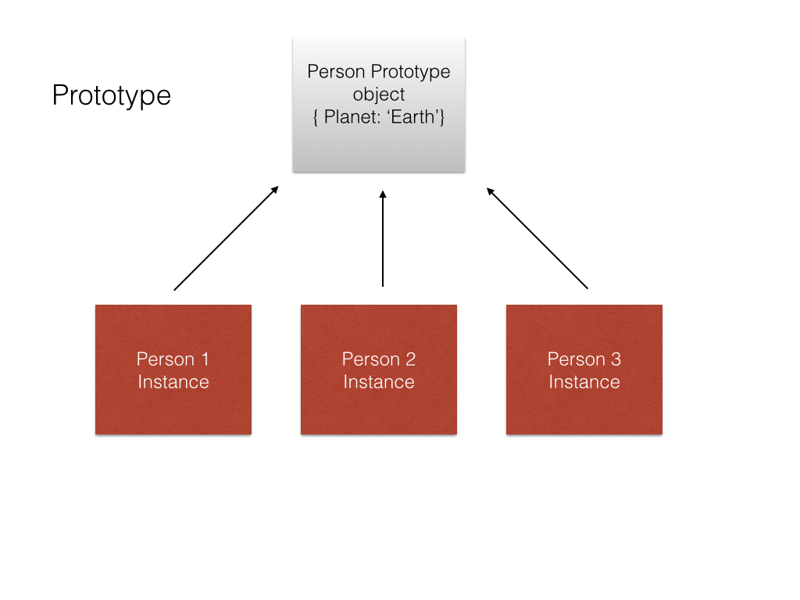
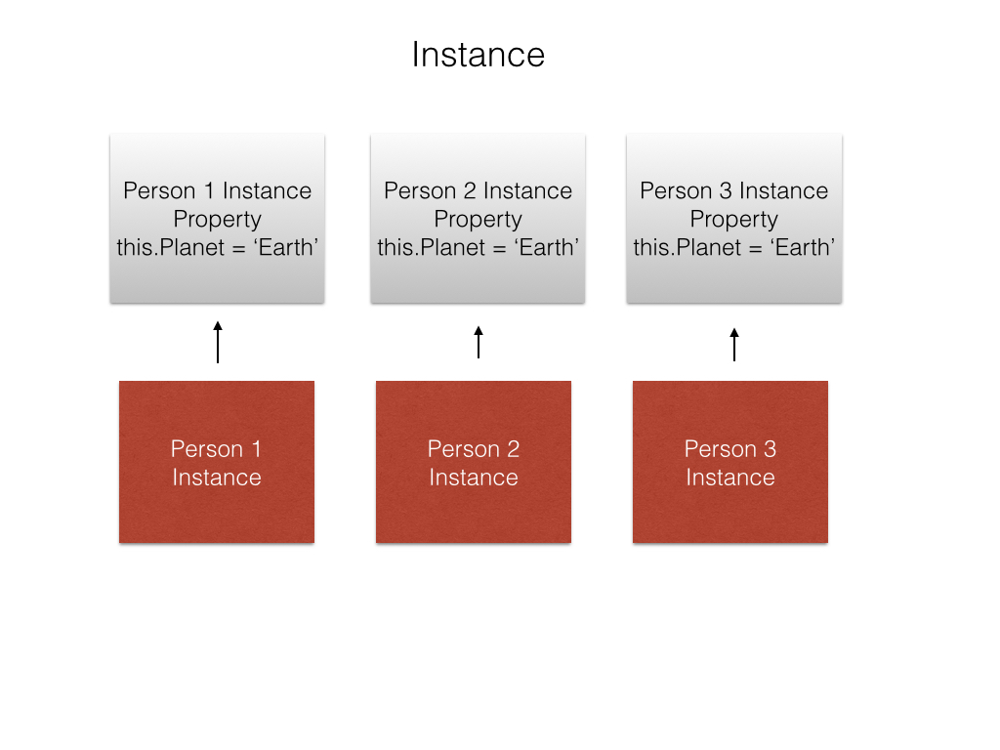

## Introduction

A `data structure` is used to denote a particular way of organizing data for particular types of operation.

An `algorithm` for a particular task can be defined as “a finite sequence of instructions, each of which has a clear meaning and can be performed with a finite amount of effort in a finite length of time”

nb: In order for JavaScript to compare two different data types (for example, numbers and strings), it must convert one type to another vy using =. This is known as `Type Coercion`. 
Strict equality (===) is the counterpart to the equality operator (==). However, unlike the equality operator, which attempts to convert both values being compared to a common type, the strict equality operator does not perform a type conversion.

---

### objects

Build JavaScript Objects
You may have heard the term object before.

Objects are similar to arrays, except that instead of using indexes to access and modify their data, you access the data in objects through what are called properties.

Objects are useful for storing data in a structured way, and can represent real world objects, like a cat.

Here's a sample cat object:

const cat = {
  "name": "Whiskers",
  "legs": 4,
  "tails": 1,
  "enemies": ["Water", "Dogs"]
};
In this example, all the properties are stored as strings, such as name, legs, and tails. However, you can also use numbers as properties. You can even omit the quotes for single-word string properties, as follows:

const anotherObject = {
  make: "Ford",
  5: "five",
  "model": "focus"
};
However, if your object has any non-string properties, JavaScript will automatically typecast them as strings.
2

##### NB
- JavaScript recognizes seven primitive (immutable) data types: Boolean, Null, Undefined, Number, String, Symbol (new   with ES6), and BigInt (new with ES2020), and one type for mutable items: Object. Note that in JavaScript, arrays are technically a type of object.
- Almost every value on its own in JavaScript evaluates to true, except what are known as the "falsy" values: false, 0, "" (an empty string), NaN, undefined, and null.
 `Falsy values in JavaScript are false, null, 0, "", undefined, and NaN.`
- JavaScript indexing starts at zero, not one, which means the last index is always one less than the length of the item. If you try to access an index equal to the length, the program may throw an "index out of range" reference error or print undefined.
 - splice() allows us to do just that: remove any number of consecutive elements from anywhere in an array; to remove elements from the beginning and end of arrays using shift() and pop(); unshift() and push() to add elements.
 - If we have bumbers.splice(startIndex, amountToDelete, 13, 14); the 13 and 14 are added in the 'amount to delete' part.
 -  Rather than modifying an array, slice() copies or extracts a given number of elements to a new array, leaving the array it is called upon untouched. slice() takes only 2 parameters — the first is the index at which to begin extraction, and the second is the index at which to stop rextraction (extraction will occur up to, but not including the element at this index).
 - Since arrays can be changed, or mutated, at any time, there's no guarantee about where a particular piece of data will be on a given array, or if that element even still exists. JavaScript provides a built-in method, indexOf(), that allows a quick and easily check for the presence of an element on an array. It takes an element as a parameter, and when called, it returns the position, or index, of that element, or -1 if the element does not exist on the array.
 - The advantage of the constructor property is that it's possible to check for this property to find out what kind of object it is; since the constructor property can be overwritten (which will be covered in the next two challenges) it’s generally better to use the instanceof method to check the type of an object.


`
function joinBirdFraternity(candidate) {
  if (candidate.constructor === Bird) {
    return true;
  } else {
    return false;
  }
}
`

 - ##### Own properties are defined directly on the object instance itself. And prototype properties are defined on the prototype.
 - ###### In the image below,
  each instance of person is linked to the same prototype object. This saves memory if multiple instances are created pointing to the same object. However, if you change 'Earth' to 'Mars' every instance will have the same change.
 

 - ###### In the image below,
  each instance will point to a completely different property linked specifically to that instance. If you believe a specific planet can change names, you should do this.. otherwise use prototype because this will use more resources.
 .

 - ###### To set the Child's Prototype to an Instance of the Parent
   where Dog class inherits from Animal prototype
 `
  function Animal() { }

    Animal.prototype = {
      constructor: Animal,
      eat: function() {
        console.log("nom nom nom");
      }
    };

    function Dog() {
      Dog.prototype = Object.create(Animal.prototype)
    }
    let beagle = new Dog(); 
 `
 When an object inherits its prototype from another object, it also inherits 
 the supertype's constructor property; hence manually set the constructor property of Dog to the Dog object:
  as:
` 
  Bird.prototype.constructor = Bird;
  duck.constructor
`
- ###### Mixin
Use a Mixin to Add Common Behavior Between Unrelated Objects where there both objects share the 
same function but inheritance is not the best solution. It allows other objects to use a collection of functions.
`
let flyMixin = function(obj) {
  obj.fly = function() {
    console.log("Flying, wooosh!");
  }
};
The flyMixin takes any object and gives it the fly method.

let bird = {
  name: "Donald",
  numLegs: 2
};

let plane = {
  model: "777",
  numPassengers: 524
};

flyMixin(bird);
flyMixin(plane);

`

#### Accessing Object Properties with Variables
- Another use of bracket notation on objects is to access a property which is stored as the value of a variable. - This can be very useful for iterating through an object's properties or when accessing a lookup table.

Here is an example of using a variable to access a property:

`
const dogs = {
  Fido: "Mutt",
  Hunter: "Doberman",
  Snoopie: "Beagle"
};


const myDog = "Hunter";
const myBreed = dogs[myDog];
console.log(myBreed);
`
The string Doberman would be displayed in the console.

- ###### Using Immediately Invoked Function Expression (IIFE)
In JavaScript to execute a function as soon as it is declared we use two parentheses () at the end of the function expression to cause it to be immediately executed or invoked. 
Note that the function has no name and is not stored in a variable. 
`
(function () {
  console.log("Chirp, chirp!");
})();
`
This is an anonymous function expression that executes right away, and outputs Chirp, chirp! immediately.

- ###### Use an IIFE to Create a Module
An immediately invoked function expression (IIFE) is often used to group related functionality into a single object or module. For example:

function glideMixin(obj) {
  obj.glide = function() {
    console.log("Gliding on the water");
  };
}
function flyMixin(obj) {
  obj.fly = function() {
    console.log("Flying, wooosh!");
  };
}
Can be grouped into a module as follows:

let motionModule = (function () {
  return {
    glideMixin: function(obj) {
      obj.glide = function() {
        console.log("Gliding on the water");
      };
    },
    flyMixin: function(obj) {
      obj.fly = function() {
        console.log("Flying, wooosh!");
      };
    }
  }
})();
Note that you have an immediately invoked function expression (IIFE) that returns an object motionModule. This returned object contains all of the mixin behaviors as properties of the object. The advantage of the module pattern is that all of the motion behaviors can be packaged into a single object that can then be used by other parts of your code. Here is an example using it:

motionModule.glideMixin(duck);
duck.glide();

### Queue

In Computer Science a queue is an abstract Data Structure where items are kept in order. New items can be added at the back of the queue and old items are taken off from the front of the queue.

### Arrays

In computer science, the obvious way to store an ordered collection of items is as an array where array items are typically stored in a sequence of computer memory locations.

```
var a = [23,4,556,231,5646,88,35]

console.log(a.length) -> 7
console.log(a[0]) -> 23
```

The element in the 7th position is 35, and we use the notation `a[7]` to denote this element; therefore, for any integer i denoting a position, we write `a[i]` to denote the element in the i th position. This position i is called an index.

_NB: In most modern programming languages, = denotes assignment, while
equality is expressed by ==_

---`

### Loops and Iterations

The standard approach in most programming languages for repeating a process a certain number of times, such as moving sequentially through an array to perform the same operations on each item, involves a loop.

```
for (let i = 0, sum = 0; i < a.length; i++) {
    sum+=a[i]
    // a.lenght is the length of the array (7)
    console.log(sum);
    // sum = sum + a[i] is the same as sum = sum + a[i] + a[i+1] + a[i+2] + a[i+3] + a[i+4] + a[i+5] + a[i+6]
}

```

We say that there is iteration over the index i. The general for-loop structure is
```
    for ( INITIALIZATION ; CONDITION ; UPDATE ) {
     REPEATED PROCESS
    }
```
---

### Invariants
Describes a condition that does not change during execution of a given program or algorithm; they are important for dsa because they enable `correctness proofs` and `verification`

```
var b = [1,2,3,4,5]
var n = b.length
    let min = b[0];
    console.log(min,"START");
    // min equals the minimum item in a[0],...,a[0]
    
    for(let i = 1 ; i != n ; i++) {
        console.log(min,"Iteration");
    // min equals the minimum item in a[0],...,a[i-1]

    if (a[i] < min) min = a[i];
    }
    console.log(min,"End");
    // min equals the minimum item in a[0],...,a[i-1], and i==n

```

_check imgs folder (invariant.png)_

This is a proof by induction example where the invariant is true at the start of the loop, and is preserved by each iteration of the loop, therefore it must be true at the end of the loop.

---

### Linked Lists
Are a linear collections of data elements where each element points to the next; each node is composed of data and a reference `link` to the next node in the sequence. 
- allows for efficient insertion or removal of elements from any position in the sequence during iteration.
- access time is linear; difficult to pipeline. Unlike arrays, random access of data elements is not allowed. Nodes are accessed sequentially starting from the first node.
- It uses more memory than arrays because of the storage of the pointers.

### Recursion

Replace Loops using Recursion
Recursion is the concept that a function can be expressed in terms of itself. To help understand this, start by thinking about the following task: multiply the first n elements of an array to create the product of those elements. Using a for loop, you could do this:

```
  function multiply(arr, n) {
    let product = 1;
    for (let i = 0; i < n; i++) {
      product *= arr[i];
    }
    return product;
  }
```
However, notice that multiply(arr, n) == multiply(arr, n - 1) * arr[n - 1]. That means you can rewrite multiply in terms of itself and never need to use a loop.


```
  function multiply(arr, n) {
    if (n <= 0) {
      return 1;
    } else {
      return multiply(arr, n - 1) * arr[n - 1];
    }
  }
```
The recursive version of multiply breaks down like this. In the base case, where n <= 0, it returns 1. For larger values of n, it calls itself, but with n - 1. That function call is evaluated in the same way, calling multiply again until n <= 0. At this point, all the functions can return and the original multiply returns the answer.

Note: Recursive functions must have a base case when they return without calling the function again (in this example, when n <= 0), otherwise they can never finish executing.
##### Base case 
It tells the recursive function when it no longer needs to call itself. It is a simple case where the return value is already known. There will also be a recursive call which executes the original function with different arguments. If the function is written correctly, eventually the base case will be reached.

##### use recursion by calling itself
The function will return an array of integers which begins with a number represented by the startNum parameter and ends with a number represented by the endNum parameter. 
The starting number will always be less than or equal to the ending number. 
This function uses recursion by calling itself and doesn't use loops of any kind && also works for cases where both startNum and endNum are the same.

`
function rangeOfNumbers(startNum, endNum) {
  if (endNum < startNum) {
    return [];
  } else {
    const numbers = rangeOfNumbers(startNum, endNum - 1);
    numbers.push(endNum);
    return numbers;
  }
}
`

## Notables

##### Math.floor( Math.random() * (max - min) + min)
We know that Math.random() returns a value in the range [0, 1). 0 is included but 1 is excluded. You can think of it as the range 0 to 0.999999...

Now let's pass that result to the Math.floor() function.

Math.floor(Math.random());
Since floor will truncate the decimal and give you back the whole number part we're always going to get 0 here. Make sure you understand that or the rest isn't going to make any sense. Ask questions if you need to.

We can only get 1 integer out of this. It's not so much important that the integer is 0 but that we can only get 1 integer out.

If we are going to be able to get more numbers out of this then we need to make that range bigger. When you multiply something by 2 it becomes twice as big as it was before. It scales up by a factor of 2. Let's see what happens when we multiply Math.random() by 2

Math.floor(Math.random() * 2);
That will give us a new range of 0 to 1.999999... which is twice as big as the range we started with.

What happens when those numbers are passed into Math.floor? All the numbers generated from 0 to 0.9999... will be truncated to 0 and all the numbers from 1 to 1.9999... will be truncated to 1

Now we're able to get 2 different integers out of this. If we multiply by 2 we can get 2 numbers back. It stands to reason that if we multiply by 6 then we will be able to get 6 numbers out.

That will give us a range that's 6 times as big, 0 to 5.99999.....

I won't write it all out but after passing through the floor function you would get

0 to .99999... -> 0
1 to 1.99999... -> 1
...
5 to 5.99999... -> 5
In general, whatever you multiply Math.random() by is how many integers you'll be able to generate.

Now we can start deriving the formula and I'll use a specific example to help.

Let's say we want to generate numbers from 5 to 10 inclusive. We need to know how many numbers are there.

Setting up the variables -

var max = 10;
var min = 5;
If we list them out, 5, 6, 7, 8, 9, 10 and count them we see that there are 6 total numbers. We know from before that we're going to have to multiply by 6 in order to get 6 numbers out.

How can we come up with the 6 using our max and min variables?? If I do max - min I get 5 which is 1 short. max - min gives you the distance from 5 to 10. You always have to add 1 to that if you want the total amount of numbers.

That gives us the expression max - min + 1

Putting that into the formula,

Math.floor(Math.random() * (max - min + 1));
It's important that max - min + 1 is enclosed in parentheses so that all of that happens before the multiplication.

At this point the formula can generate the correct amount of numbers but they always start at 0 because the range from Math.random starts from 0.

0, 1, 2, 3, 4,  5 // What we have
5, 6, 7, 8, 9, 10 // What we want
Notice that if we add 5 to all the numbers in the first row, we'll get the second row. 5 is what our min value is in the example.

So if we add the min value onto the end of our formula, it will shift all the numbers over to the ones we want.

Math.floor(Math.random() * (max - min + 1)) + min;

##### The conditional operator (ternary operator) 
Can be used as a one line if-else expression.

The syntax is a ? b : c, where a is the condition, b is the code to run when the condition returns true, and c is the code to run when the condition returns false.

##### To check if num is +ve or -ve
`
function checkSign(num) {
  return num > 0 ? "positive"
    : num < 0 ? "negative"
    : "zero";
}
`

##### ES6 Syntax
One key difference between the spread operator and array destructuring is that the spread operator unpacks all contents of an array into a comma-separated list. Consequently, you cannot pick or choose which elements you want to assign to variables.

Destructuring an array lets us do exactly that:

const [a, b] = [1, 2, 3, 4, 5, 6];
console.log(a, b);
The console will display the values of a and b as 1, 2.

The variable a is assigned the first value of the array, and b is assigned the second value of the array. We can also access the value at any index in an array with destructuring by using commas to reach the desired index:

const [a, b,,, c] = [1, 2, 3, 4, 5, 6];
console.log(a, b, c);
The console will display the values of a, b, and c as 1, 2, 5.

Sample Codes
By using a destructuring assignment to emulate the behavior of Array.prototype.slice().removeFirstTwo() to return a sub-array of the original array list with the first two elements omitted.
If you console log list,, should give thev array without 1 & 2
`
function removeFirstTwo(list) {
  const [a,b, ...arr] = list
  list = arr
  return list;
}

const source = [1, 2, 3, 4, 5, 6, 7, 8, 9, 10];
const sourceWithoutFirstTwo = removeFirstTwo(source);

`

https://blog.webdevsimplified.com/2020-08/destructuring-and-spread/

##### REGEX [Cheatsheet](https://www.shortcutfoo.com/app/dojos/regex/cheatsheet)

Regular expressions are used in programming languages to match parts of strings. TO create patterns to help you that matching.

To find the word the in the string The dog chased the cat, one could use the following regular expression: /the/. Notice that quote marks are not required within the regular expression.

JavaScript has multiple ways to use regexes. One way to test a regex is
 using the .test() method. The .test() method takes the regex, applies it to a string (which is placed inside the parentheses), and returns true or false if your pattern finds something or not.

`
let testStr = "freeCodeCamp";
let testRegex = /Code/;
testRegex.test(testStr);
`

The test method here returns true.You can also extract the actual matches you found with the .match() method. Note that the .match syntax is the "opposite" of the .test method as:

`
'string'.match(/regex/);
/regex/.test('string');
`

`
let ourStr = "Regular expressions";
let ourRegex = /expressions/;
ourStr.match(ourRegex);
`

Here match would return ["expressions"].
To search or extract a pattern more than once, you can use the global search flag: g and insensitive flag i for ignoring case.

`
let testStr = "Repeat, Repeat, Repeat";
let ourRegex = /Repeat/g;
testStr.match(ourRegex);
`

here match returns the value ["Repeat", "Repeat", "Repeat"]

If you don't know the exact characters in your patterns, you can save time using the wildcard character: . ( dot or period). 
For example, if you wanted to match hug, huh, hut, and hum, you can use the regex /hu./ to match all four words.

You can search for a literal pattern with some flexibility with character classes. Character classes allow you to define a group of characters you wish to match by placing them inside square ([ and ]) brackets.

For example, you want to match bag, big, and bug but not bog. You can create the regex /b[aiu]g/ to do this. The [aiu] is the character class that will only match the characters a, i, or u.

Inside a character set, you can define a range of characters to match using a hyphen character: -.

For example, to match lowercase letters a through e you would use [a-e].
`
let catStr = "cat";
let batStr = "bat";
let matStr = "mat";
let bgRegex = /[a-e]at/;
catStr.match(bgRegex);
batStr.match(bgRegex);
matStr.match(bgRegex);
`
In order, the three match calls would return the values ["cat"], ["bat"], and null.

To create a negated character set(for a set of characters that you do not want to match), you place a caret character (^) after the opening bracket and before the characters you do not want to match.
For example, /[^aeiou]/gi matches all characters that are not a vowel. Note that characters like ., !, [, @, / and white space are matched - the negated vowel character set only excludes the vowel characters.

NB:
Outside of a character set, the caret is used to search for patterns at the beginning of strings.
`
let firstString = "Ricky is first and can be found.";
let firstRegex = /^Ricky/;
firstRegex.test(firstString);
let notFirst = "You can't find Ricky now.";
firstRegex.test(notFirst);
The first test call would return true, while the second would return false.
`
To search for patterns at the end of strings use the dollar sign character $ at the end of the regex.

To match a character/group of characters that appears one or more times in a row and may be repeated; we use the + character to check if that is the case (but the character has to repeat one after the other).

For example, /a+/g would find one match in abc and return ["a"]. Because of the +, it would also find a single match in aabc and return ["aa"]. If it were instead checking the string abab, it would find two matches and return ["a", "a"] because the a characters are not in a row - there is a b between them. Finally, since there is no a in the string bcd, it wouldn't find a match.
There's also an option that matches characters that occur zero or more times (asterisk or star: *). Remember the wildcard . in a regular expression matches any character.  

Any letter in a regex expression that is followed by a * does not have to occur in the string tested whereas any letter in a regex expression followed by a + must occur in a string at least once, as shown below,
`
let phrase = "ba humbug";

let regexPlus = /bah+/;
let regexStar = /bah*/;

regexPlus.test(phrase); // returns false
regexStar.test(phrase); // returns true
`

The shortcut to look for digit characters is \d, with a lowercase d. This is equal to the character class [0-9], which looks for a single character of any number between zero and nine.
The shortcut to look for non-digit characters is \D. This is equal to the character class [^0-9], which looks for a single character that is not a number between zero and nine.   

Search for non-whitespace using \S, which is an uppercase s; \s searches for whitespace. This pattern will not match whitespace, carriage return, tab, form feed, and new line characters. You can think of it being similar to the character class [^ \r\t\f\n\v].

To Specify Upper and Lower Number of Matches number of patterns with quantity specifiers we use curly brackets ({ and }). You put two numbers between the curly brackets - for the lower and upper number of patterns.
Example
`
let ohStr = "Ohhh no";
let ohRegex = /Oh{3,6}\sno/; // Change this line
let result = ohRegex.test(ohStr);
`

To check for existence of a letter;i.e, the previous element is optional, we use ? e.g Favou?rite to show (u) is optional as in American English.

###### For lookaheads: 
1. A positive lookahead will look to make sure the element in the search pattern is there, but won't actually match it. A positive lookahead is used as (?=...) where the ... is the required part that is not matched.

2. A negative lookahead will look to make sure the element in the search pattern is not there. A negative lookahead is used as (?!...) where the ... is the pattern that you do not want to be there. The rest of the pattern is returned if the negative lookahead part is not present.

###### Quick Test
[-] For
Usernames can only use alphanumeric characters.

The only numbers in the username have to be at the end. There can be zero or more of them at the end. Username cannot start with the number.

Username letters can be lowercase and uppercase.

Usernames have to be at least two characters long. A two-character username can only use alphabet letters as characters.
`
let username = "JackOfAllTrades";
let userCheck = /^[a-z][a-z]+\d*$|^[a-z]\d\d+$/i;
let result = userCheck.test(username);
console.log(result)
`
[-] where:
- ^ - start of input
- [a-z] - first character is a letter
- [a-z]+ - following characters are letters
- \d*$ - input ends with 0 or more digits
- | - or
- ^[a-z] - first character is a letter
- \d\d+ - following characters are 2 or more digits
- $ - end of input

To select a substrings at the beginning or end of a string.use -> let all = /^\s+|\s+$/g;


#### Map()
The map method iterates over each item in an array and returns a new array containing the results of calling the callback function on each element. It does this without mutating the original array; It doesn't alter the original array, as long as its callback function doesn't.

When the callback is used, it is passed three arguments. The first argument is the current element being processed. The second is the index of that element and the third is the array upon which the map method was called.

In other words, map is a pure function, and its output depends solely on its inputs. Plus, it takes another function as its argument.

A sample myMap function that would act as Map() function
`
Array.prototype.myMap = function(callback) {
  const newArray = [];
  for (let i = 0; i < this.length; i++) {
    newArray.push(callback(this[i], i, this));
  }
  return newArray;
};
`

#### Filter() / Array.prototype.filter()

The filter calls a function on each element of an array and returns a new array containing only the elements for which that function returns a truthy value - that is, a value which returns true if passed to the Boolean() constructor. 
In other words, it filters the array, based on the function passed to it. Like map, it does this without needing to modify the original array.

The callback function accepts three arguments. The first argument is the current element being processed. The second is the index of that element and the third is the array upon which the filter method was called.

A sample myFilter function that would act as Filter() function
`
  Array.prototype.myFilter = function(callback) {
  const newArray = [];
  for (let i=0; i<this.length; i++){
    if(callback(this[i],i,this)){
      newArray.push(this[i])
    }
  }
  return newArray;
};
`

#### Slice() - Return Part of an Array

The slice method returns a copy of certain elements of an array. ( does not mutate the original array, but returns a new one which can be saved into a variable)
It can take two arguments, the first gives the index of where to begin the slice & the second is the index for where to end the slice (and it's non-inclusive). 
NB::If the arguments are not provided, the default is to start at the beginning of the array through the end, which is an easy way to make a copy of the entire array. The slice method does not mutate the original array, but returns a new one

###### Splice vs Slice
To remove items and keep the rest of the array, JavaScript offers the splice method that takes arguments for the index of where to start removing items, then the number of items to remove. 
NB::If the second argument is not provided, the default is to remove items through the end. 
The splice method mutates the original array it is called on hence using the slice method instead of splice helps to avoid any array-mutating side effects.

###### Return Alphabetical order 
If compareFunction(a,b) returns a value less than 0 for two elements a and b, then a will come before b. If compareFunction(a,b) returns a value greater than 0 for two elements a and b, then b will come before a. If compareFunction(a,b) returns a value equal to 0 for two elements a and b, then a and b will remain unchanged.

i.e::
We will use the sort() method alongside the compare function to order this array of users by name.

We will use the compare function to define an alternative sort order. It returns a negative, zero, or positive value, depending on the arguments:

Syntax:

function(a, b){return a - b}
When we pass this comparison function into the sort() method, it compares each value based on the condition we set and then sorts each name according to the returned value (negative, zero, positive).

If the result is negative, a is sorted before b.
If the result is positive, b is sorted before `a'.
If the result is 0, no changes are made to the sort order of the two values.

`
function alphabeticalOrder(arr) {
  return arr.sort(function(a,b){
    return a===b ? 0 : a < b ? -1:1;
  })
}

let answer = alphabeticalOrder(["a", "d", "c", "a", "z", "g"]);
console.log(answer)
`

Without mutating the array()

`
const globalArray = [5, 6, 3, 2, 9];

function nonMutatingSort(arr) {
let newArr = arr.slice()

return newArr.sort(function(a,b){
  return a===b ? 0 : a<b ? -1:1
})

}

nonMutatingSort(globalArray);
`

###### to Combine an Array into a String Using the join Method
`
function sentensify(str) {
  return str.split(/\W/).join(" ");
}
sentensify("May-the-force-be-with-you");
`

###### to Convert Strings to URL Slugs
`
function urlSlug(title) {
return title.trim().split(/\s+/).join("-").toLowerCase() 
}
`

###### Currying in a function
This technique converts N arguments function calls into N function call chains, with each function call having a single argument. Currying returns a function with an argument until all the arguments are applied. Then, you have to continue to call the returned function until the arguments have been exhausted and it returns the final value.
function add(a){
  return function(b){
    return a + b
  }
}

add(3)(5)

###### Partial Application 
Described as applying a few arguments to a function at a time and returning another function that is applied to more arguments:

function impartial(x, y, z) {
  return x + y + z;
}

const partialFn = impartial.bind(this, 1, 2);
partialFn(10); // 13

###### Sum of all numbers between a range 

function sumAll(arr) {
  let max = Math.max(arr[0], arr[1])
  let min = Math.min(arr[0], arr[1])
  let sum = 0;

  for (let i = min; i<=max; i++){
    sum+=i;
  }
  return sum;
}